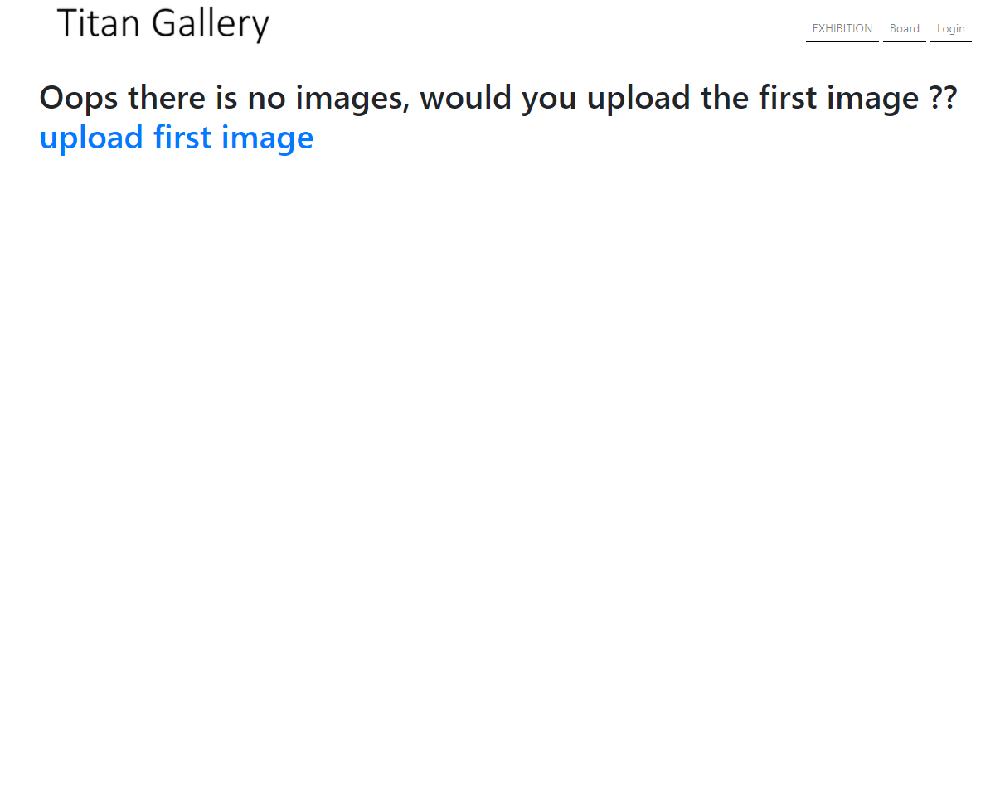
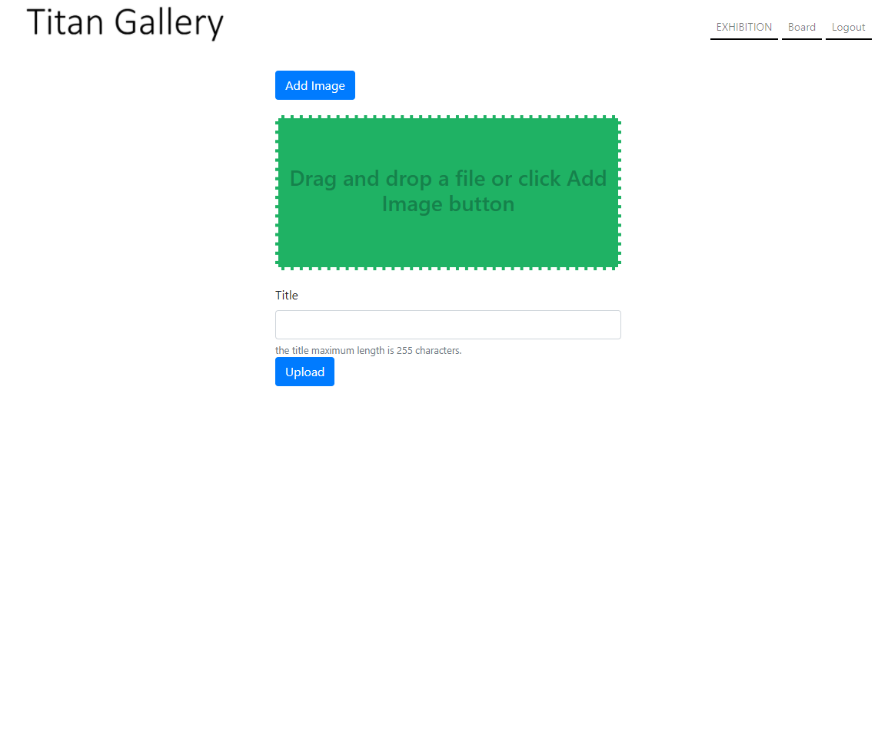
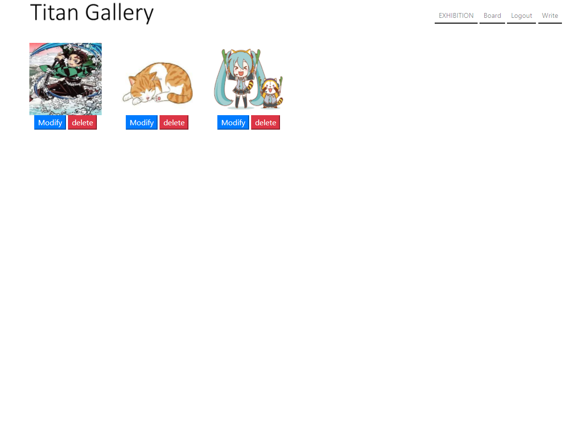

# flask_gallery(Titan Gallery)
this is a simple gallery make with flask framework!!

## Requirements
*   mysql==5.7.31
*   Flask>=1.1.2
*   mysql-connector-python>=8.0.21
*   pillow>=7.2.0
*   pycryptodomex>=3.9.8

## How to use
i assume that your host os is ubuntu 18.04  
install mysql 5.7.x version and execute sample.sql file
```
$ sudo mysql < sample.sql
```
grant permission on gallery database to created user(you can change password and secret_key => check setting.py)  
first create user,
```
mysql> CREATE USER 'user1'@'localhost' IDENTIFIED BY 'Pass12!@#';
```
second grant permission,
```
mysql> GRANT ALL PRIVILEGES ON gallery.* TO 'user1'@'localhost' WITH GRANT OPTION;
```
add some flask enviorment variables
```
$ export FLASK_APP=app.py
$ export FLASK_ENV=production
```
make images directory in static folder
```
$ mkdir images => /flask_gallery/static/images
```
run flask and enjoy
```
$ flask run --host='your ip address' --port='accessible port'
```

## Sample images
### image1


### image2


### image3
